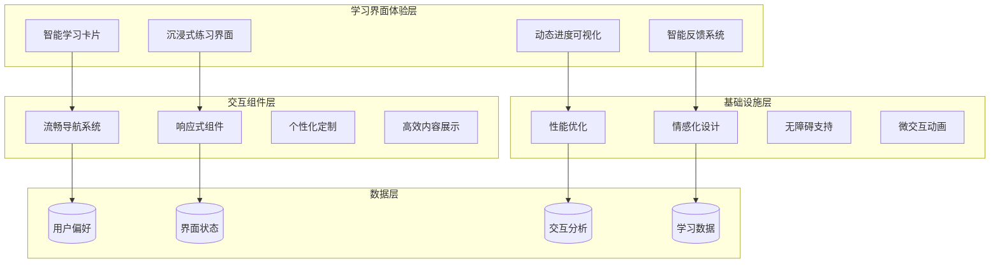

# UI/UX学习界面体验优化设计文档

## 概述

本设计文档专注于双语导师系统的学习界面体验优化，基于现有的UI设计基础，深度改进学习卡片、练习界面、进度展示等核心学习组件。设计目标是创造更加直观、高效、愉悦的语言学习体验，通过精心设计的交互和视觉元素，提升用户的学习动力和效果。

设计采用以用户为中心的方法，结合现代UI/UX最佳实践，特别关注中文用户的使用习惯和学习特点。通过智能化的界面设计、流畅的交互动画、个性化的视觉反馈，打造沉浸式的语言学习环境。

## 架构

UI/UX优化采用组件化设计架构，将学习界面分解为可复用的设计组件和交互模式：



## 组件和接口

### 智能学习卡片系统 (Smart Learning Card System)

**设计理念：** 将学习活动以卡片形式呈现，通过视觉层次、状态指示、交互反馈等设计元素，帮助用户快速理解和选择学习内容。

**核心组件：**

#### 学习卡片容器 (Learning Card Container)
```typescript
interface LearningCardProps {
  activity: LearningActivity;
  status: CardStatus;
  onSelect: (activity: LearningActivity) => void;
  onReorder: (fromIndex: number, toIndex: number) => void;
  showPreview: boolean;
  customizable: boolean;
}

interface CardStatus {
  type: 'new' | 'review' | 'difficult' | 'completed';
  progress: number; // 0-100
  priority: 'high' | 'medium' | 'low';
  estimatedTime: number; // minutes
}
```

**视觉设计规范：**
- **卡片尺寸**: 最小320px宽度，高度根据内容自适应
- **圆角**: 12px，营造现代感
- **阴影**: 静态时使用subtle shadow，悬停时提升至medium shadow
- **边框**: 1px solid，颜色根据状态变化
- **内边距**: 24px，确保内容呼吸感

**状态视觉标识：**
```css
/* 新内容 - 蓝色系 */
.card-new {
  border-left: 4px solid #3b82f6;
  background: linear-gradient(135deg, #eff6ff 0%, #ffffff 100%);
}

/* 复习内容 - 橙色系 */
.card-review {
  border-left: 4px solid #f59e0b;
  background: linear-gradient(135deg, #fffbeb 0%, #ffffff 100%);
}

/* 困难内容 - 红色系 */
.card-difficult {
  border-left: 4px solid #ef4444;
  background: linear-gradient(135deg, #fef2f2 0%, #ffffff 100%);
}

/* 已完成 - 绿色系 */
.card-completed {
  border-left: 4px solid #22c55e;
  background: linear-gradient(135deg, #f0fdf4 0%, #ffffff 100%);
  opacity: 0.8;
}
```

#### 卡片交互动画
```css
.learning-card {
  transition: all 0.3s cubic-bezier(0.4, 0, 0.2, 1);
  transform: translateY(0);
}

.learning-card:hover {
  transform: translateY(-4px);
  box-shadow: 0 20px 25px -5px rgba(0, 0, 0, 0.1), 
              0 10px 10px -5px rgba(0, 0, 0, 0.04);
}

.learning-card:active {
  transform: translateY(-2px);
  transition-duration: 0.1s;
}
```

### 沉浸式练习界面 (Immersive Practice Interface)

**设计理念：** 创造专注的学习环境，最小化干扰，突出练习内容，通过清晰的视觉层次和即时反馈提升学习效率。

**界面布局结构：**
```html
<div class="practice-container">
  <!-- 顶部进度条 -->
  <header class="practice-header">
    <div class="progress-bar">
      <div class="progress-fill" style="width: 40%"></div>
    </div>
    <div class="question-counter">3 / 8</div>
  </header>
  
  <!-- 主要练习区域 -->
  <main class="practice-content">
    <div class="question-area">
      <!-- 题目内容 -->
    </div>
    <div class="answer-area">
      <!-- 答题区域 -->
    </div>
  </main>
  
  <!-- 底部控制区 -->
  <footer class="practice-controls">
    <button class="btn-secondary">跳过</button>
    <button class="btn-primary">确认</button>
  </footer>
</div>
```

**专注模式设计：**
- **背景**: 使用柔和的单色背景，减少视觉干扰
- **内容居中**: 练习内容在屏幕中央，最大化注意力集中
- **隐藏导航**: 练习过程中隐藏主导航，只保留必要控制
- **全屏模式**: 支持全屏练习，完全沉浸的学习体验

#### 即时反馈系统
```typescript
interface FeedbackState {
  type: 'correct' | 'incorrect' | 'partial';
  message: string;
  explanation?: string;
  audioUrl?: string;
  nextAction: 'continue' | 'retry' | 'review';
}

interface FeedbackAnimation {
  duration: number;
  easing: string;
  effects: ('shake' | 'bounce' | 'glow' | 'pulse')[];
}
```

**反馈动画设计：**
```css
/* 正确答案动画 */
@keyframes correct-feedback {
  0% { transform: scale(1); }
  50% { transform: scale(1.05); }
  100% { transform: scale(1); }
}

.feedback-correct {
  animation: correct-feedback 0.6s ease-out;
  background-color: #dcfce7;
  border-color: #22c55e;
}

/* 错误答案动画 */
@keyframes incorrect-feedback {
  0%, 20%, 40%, 60%, 80% { transform: translateX(-2px); }
  10%, 30%, 50%, 70%, 90% { transform: translateX(2px); }
  100% { transform: translateX(0); }
}

.feedback-incorrect {
  animation: incorrect-feedback 0.5s ease-in-out;
  background-color: #fef2f2;
  border-color: #ef4444;
}
```

### 动态进度可视化 (Dynamic Progress Visualization)

**设计理念：** 通过多样化的图表类型和动画效果，将抽象的学习数据转化为直观、有吸引力的视觉展示，激发用户的学习动力。

**图表组件库：**

#### 环形进度图 (Circular Progress)
```typescript
interface CircularProgressProps {
  value: number; // 0-100
  size: 'small' | 'medium' | 'large';
  color: string;
  animated: boolean;
  showLabel: boolean;
  duration: number; // animation duration in ms
}
```

```css
.circular-progress {
  position: relative;
  display: inline-block;
}

.progress-circle {
  transform: rotate(-90deg);
  transition: stroke-dashoffset 1s ease-in-out;
}

.progress-background {
  stroke: #e5e7eb;
  stroke-width: 8;
}

.progress-foreground {
  stroke: #3b82f6;
  stroke-width: 8;
  stroke-linecap: round;
  stroke-dasharray: 251.2; /* 2 * π * 40 */
  stroke-dashoffset: 251.2;
}
```

#### 技能雷达图 (Skill Radar Chart)
```typescript
interface SkillRadarData {
  vocabulary: number;
  grammar: number;
  listening: number;
  speaking: number;
  reading: number;
  writing: number;
}

interface RadarChartProps {
  data: SkillRadarData;
  maxValue: number;
  animated: boolean;
  interactive: boolean;
}
```

#### 学习热力图 (Learning Heatmap)
```typescript
interface HeatmapData {
  date: string;
  value: number; // 学习强度 0-4
  activities: number; // 活动数量
}

interface HeatmapProps {
  data: HeatmapData[];
  startDate: Date;
  endDate: Date;
  cellSize: number;
  colorScheme: string[];
}
```

**动画时序设计：**
```css
/* 渐进式数据加载动画 */
.chart-enter {
  opacity: 0;
  transform: translateY(20px);
}

.chart-enter-active {
  opacity: 1;
  transform: translateY(0);
  transition: all 0.6s cubic-bezier(0.4, 0, 0.2, 1);
}

/* 数据更新动画 */
.data-update {
  animation: data-pulse 0.8s ease-out;
}

@keyframes data-pulse {
  0% { transform: scale(1); }
  50% { transform: scale(1.02); }
  100% { transform: scale(1); }
}
```

### 智能反馈和指导系统 (Intelligent Feedback System)

**设计理念：** 提供分层次、个性化的学习反馈，通过视觉化元素和中文母语思维的解释方式，帮助用户理解错误并获得改进指导。

**反馈层次结构：**
```typescript
interface FeedbackHierarchy {
  level1: {
    type: 'hint';
    content: string;
    icon: string;
  };
  level2: {
    type: 'explanation';
    content: string;
    examples: string[];
    visualAids: string[];
  };
  level3: {
    type: 'knowledge';
    content: string;
    relatedTopics: string[];
    practiceExercises: string[];
  };
}
```

**视觉化反馈组件：**
```html
<div class="feedback-container">
  <!-- 反馈图标 -->
  <div class="feedback-icon">
    <svg class="icon-correct"><!-- 正确图标 --></svg>
  </div>
  
  <!-- 反馈内容 -->
  <div class="feedback-content">
    <h3 class="feedback-title">很好！</h3>
    <p class="feedback-message">您正确理解了这个语法点。</p>
    
    <!-- 可展开的详细解释 -->
    <details class="feedback-details">
      <summary>查看详细解释</summary>
      <div class="explanation-content">
        <!-- 详细内容 -->
      </div>
    </details>
  </div>
  
  <!-- 语音播放 -->
  <button class="audio-play-btn">
    <svg class="icon-speaker"><!-- 音频图标 --></svg>
  </button>
</div>
```

**中文母语思维解释模板：**
```typescript
interface ChineseExplanationTemplate {
  grammarPoint: string;
  chineseEquivalent: string;
  contrastExplanation: string;
  memoryTip: string;
  commonMistakes: string[];
}

// 示例：英语时态解释
const presentPerfectExplanation: ChineseExplanationTemplate = {
  grammarPoint: "Present Perfect Tense",
  chineseEquivalent: "现在完成时 - 表示过去发生但对现在有影响的动作",
  contrastExplanation: "与中文不同，英语需要明确表示动作的完成状态",
  memoryTip: "想象成'已经做了，现在有结果'",
  commonMistakes: ["不要与一般过去时混淆", "注意不规则动词的过去分词形式"]
};
```

### 流畅的导航和状态管理 (Smooth Navigation & State Management)

**设计理念：** 确保用户在学习过程中的导航体验流畅自然，状态保存可靠，通过面包屑、进度保存、平滑过渡等设计提升用户体验。

**导航组件架构：**
```typescript
interface NavigationState {
  currentPath: string[];
  previousPath: string[];
  learningProgress: LearningProgress;
  canGoBack: boolean;
  canGoForward: boolean;
}

interface LearningProgress {
  sessionId: string;
  currentActivity: number;
  totalActivities: number;
  completedActivities: number[];
  pausedAt?: Date;
  estimatedTimeRemaining: number;
}
```

**面包屑导航设计：**
```html
<nav class="breadcrumb-nav">
  <ol class="breadcrumb-list">
    <li class="breadcrumb-item">
      <a href="/dashboard">学习中心</a>
    </li>
    <li class="breadcrumb-item">
      <a href="/practice">练习模式</a>
    </li>
    <li class="breadcrumb-item active">
      词汇练习
    </li>
  </ol>
</nav>
```

**页面过渡动画：**
```css
/* 页面切换动画 */
.page-transition-enter {
  opacity: 0;
  transform: translateX(20px);
}

.page-transition-enter-active {
  opacity: 1;
  transform: translateX(0);
  transition: all 0.3s ease-out;
}

.page-transition-exit {
  opacity: 1;
  transform: translateX(0);
}

.page-transition-exit-active {
  opacity: 0;
  transform: translateX(-20px);
  transition: all 0.3s ease-in;
}
```

## 数据模型

### UI组件状态模型

```typescript
// 学习卡片状态
interface LearningCardState {
  id: string;
  activity: LearningActivity;
  visualState: {
    isHovered: boolean;
    isSelected: boolean;
    isDragging: boolean;
    animationState: 'idle' | 'entering' | 'exiting' | 'updating';
  };
  interactionState: {
    clickCount: number;
    hoverDuration: number;
    lastInteraction: Date;
  };
}

// 练习界面状态
interface PracticeInterfaceState {
  mode: 'focus' | 'normal' | 'fullscreen';
  currentQuestion: number;
  totalQuestions: number;
  timeRemaining: number;
  feedbackState: FeedbackState | null;
  keyboardShortcutsEnabled: boolean;
}

// 进度可视化状态
interface ProgressVisualizationState {
  activeChart: string;
  dataRange: DateRange;
  animationProgress: number;
  interactiveElements: {
    hoveredDataPoint: DataPoint | null;
    selectedTimeRange: TimeRange | null;
  };
}

// 个性化设置状态
interface PersonalizationState {
  theme: 'light' | 'dark' | 'eye-care';
  fontSize: 'small' | 'medium' | 'large';
  interfaceDensity: 'compact' | 'comfortable' | 'spacious';
  animationsEnabled: boolean;
  accessibilityMode: boolean;
  language: 'zh-CN';
}
```

### 交互分析数据模型

```typescript
// 用户交互事件
interface UserInteractionEvent {
  id: string;
  userId: string;
  timestamp: Date;
  eventType: 'click' | 'hover' | 'scroll' | 'keyboard' | 'touch';
  component: string;
  elementId: string;
  position: { x: number; y: number };
  duration?: number;
  metadata: Record<string, any>;
}

// UI性能指标
interface UIPerformanceMetrics {
  componentRenderTime: number;
  animationFrameRate: number;
  interactionResponseTime: number;
  memoryUsage: number;
  bundleSize: number;
  loadTime: number;
}

// 用户体验评分
interface UXScoreData {
  usabilityScore: number; // 0-100
  satisfactionScore: number; // 0-100
  efficiencyScore: number; // 0-100
  learnabilityScore: number; // 0-100
  accessibilityScore: number; // 0-100
  overallScore: number; // 0-100
}
```

## 正确性属性

*属性是一个特征或行为，应该在系统的所有有效执行中保持为真——本质上，是关于系统应该做什么的正式陈述。属性作为人类可读规范和机器可验证正确性保证之间的桥梁。*

### 属性1: 学习卡片信息完整性
*对于任何*学习活动数据，生成的学习卡片应该包含所有必需的信息：活动类型、预估时间、难度级别和完成状态
**验证需求: 1.1**

### 属性2: 悬停反馈一致性
*对于任何*学习卡片，当鼠标悬停时应该触发视觉反馈和信息预览的显示
**验证需求: 1.2**

### 属性3: 内容类型视觉区分
*对于任何*不同类型的学习内容（词汇、语法、阅读、听力），学习卡片应该使用独特的视觉标识进行区分
**验证需求: 1.3**

### 属性4: 状态可视化准确性
*对于任何*具有特殊状态的学习活动，学习卡片应该通过相应的颜色、图标或标记正确表示其状态
**验证需求: 1.4**

### 属性5: 拖拽排序功能性
*对于任何*学习卡片列表，拖拽操作应该能够正确更新卡片的显示顺序
**验证需求: 1.5**

### 属性6: 练习模式界面简化
*对于任何*练习模式的激活，界面应该隐藏非必要元素并突出显示练习内容
**验证需求: 2.1**

### 属性7: 进度指示器准确性
*对于任何*练习会话，进度指示器应该准确显示当前题目位置和剩余题目数量
**验证需求: 2.2**

### 属性8: 即时反馈响应性
*对于任何*用户答题行为，系统应该立即提供相应的视觉反馈（正确/错误状态）
**验证需求: 2.3**

### 属性9: 键盘快捷键响应
*对于任何*支持的键盘快捷键，练习界面应该正确响应相应的键盘事件
**验证需求: 2.4**

### 属性10: 练习总结完整性
*对于任何*完成的练习会话，总结页面应该包含成绩、错误分析和改进建议
**验证需求: 2.5**

### 属性11: 图表类型多样性
*对于任何*学习数据展示需求，系统应该使用多种图表类型来展示不同维度的数据
**验证需求: 3.1**

### 属性12: 进度动画效果
*对于任何*进度数据的更新，展示应该包含动画效果使变化更加生动
**验证需求: 3.2**

### 属性13: 里程碑庆祝反馈
*对于任何*学习里程碑的达成，系统应该提供庆祝动画和成就徽章展示
**验证需求: 3.3**

### 属性14: 图表交互功能
*对于任何*进度图表，用户应该能够通过点击查看详细数据和历史趋势
**验证需求: 3.4**

### 属性15: 个性化洞察生成
*对于任何*用户的进度数据，系统应该提供个性化的中文洞察和改进建议
**验证需求: 3.5**

### 属性16: 分层错误解释
*对于任何*用户的错误答案，系统应该提供分层次的解释（简要提示→详细解释→相关知识点）
**验证需求: 4.1**

### 属性17: 视觉化反馈元素
*对于任何*反馈界面，应该使用图标、颜色、插图等视觉元素增强理解效果
**验证需求: 4.2**

### 属性18: 中文母语解释方式
*对于任何*语法解释，系统应该使用中文母语思维的解释方式
**验证需求: 4.3**

### 属性19: 语音播放支持
*对于任何*反馈内容，系统应该支持语音播放功能帮助用户学习发音
**验证需求: 4.4**

### 属性20: 反馈偏好记忆
*对于任何*用户的反馈偏好设置，系统应该记住并在后续提供个性化的指导深度
**验证需求: 4.5**

### 属性21: 学习状态持久化
*对于任何*页面切换操作，系统应该保存当前的学习进度和状态
**验证需求: 5.1**

### 属性22: 导航路径可用性
*对于任何*学习会话，导航应该提供面包屑和返回路径功能
**验证需求: 5.2**

### 属性23: 暂停控制功能
*对于任何*学习会话，系统应该提供明确的暂停和继续控制
**验证需求: 5.3**

### 属性24: 页面过渡流畅性
*对于任何*页面切换，应该使用平滑的过渡动画避免突兀跳转
**验证需求: 5.4**

### 属性25: 适时引导提供
*对于任何*新用户或新功能，系统应该在适当时机提供学习提示和引导
**验证需求: 5.5**

### 属性26: 移动端触摸适配
*对于任何*移动设备使用场景，学习卡片应该适配触摸操作并提供合适的点击区域
**验证需求: 6.1**

### 属性27: 响应式布局适配
*对于任何*屏幕尺寸，练习界面应该调整布局确保内容清晰可读
**验证需求: 6.2**

### 属性28: 小屏幕图表可读性
*对于任何*小屏幕设备，进度图表应该保持可读性或提供简化视图
**验证需求: 6.3**

### 属性29: 手势操作支持
*对于任何*触摸设备，系统应该支持滑动切换、双击放大等手势操作
**验证需求: 6.4**

### 属性30: 设备交互优化
*对于任何*设备类型，系统应该根据设备特性优化交互方式（鼠标悬停 vs 触摸反馈）
**验证需求: 6.5**

### 属性31: 主题选择可用性
*对于任何*用户设置访问，系统应该提供浅色、深色、护眼模式的主题选择
**验证需求: 7.1**

### 属性32: 可访问性设置功能
*对于任何*用户的视觉需求，系统应该支持字体大小和界面密度的调整
**验证需求: 7.2**

### 属性33: 布局个性化支持
*对于任何*用户偏好，系统应该支持学习界面布局的个性化调整
**验证需求: 7.3**

### 属性34: 无障碍功能支持
*对于任何*有视觉障碍的用户，系统应该提供高对比度模式和屏幕阅读器支持
**验证需求: 7.4**

### 属性35: 设置同步一致性
*对于任何*个性化设置，应该在所有设备间同步保持一致的用户体验
**验证需求: 7.5**

### 属性36: 词汇卡片动画效果
*对于任何*词汇展示，系统应该使用卡片翻转动画展示单词和释义
**验证需求: 8.1**

### 属性37: 内容层次结构
*对于任何*语法解释，应该使用可折叠的层次结构让用户按需查看详细内容
**验证需求: 8.2**

### 属性38: 阅读排版质量
*对于任何*阅读材料，应该提供舒适的排版包括合适的行间距和段落间距
**验证需求: 8.3**

### 属性39: 音频控件可视化
*对于任何*包含音频的内容，系统应该提供可视化的音频播放控件
**验证需求: 8.4**

### 属性40: 标记笔记功能
*对于任何*复杂内容，应该支持标记和笔记功能帮助用户记录重点
**验证需求: 8.5**

### 属性41: 加载状态指示
*对于任何*内容加载过程，系统应该显示有意义的加载状态而不是空白页面
**验证需求: 9.1**

### 属性42: 渐进式加载策略
*对于任何*图片和音频内容，应该支持渐进式加载优先显示重要内容
**验证需求: 9.2**

### 属性43: 动画性能保证
*对于任何*界面动画，应该流畅运行保持60fps以上的帧率
**验证需求: 9.3**

### 属性44: 网络适配能力
*对于任何*网络较慢的情况，系统应该提供离线模式或简化版界面
**验证需求: 9.4**

### 属性45: 预加载优化效果
*对于任何*页面切换，应该使用预加载技术减少用户等待时间
**验证需求: 9.5**

### 属性46: 任务完成庆祝
*对于任何*学习任务的完成，系统应该提供庆祝动画和正面反馈
**验证需求: 10.1**

### 属性47: 积极视觉氛围
*对于任何*界面元素，应该使用温暖、友好的色彩和图标营造积极的学习氛围
**验证需求: 10.2**

### 属性48: 鼓励性错误提示
*对于任何*错误提示，应该使用鼓励性的语言避免让用户感到挫败
**验证需求: 10.3**

### 属性49: 适时激励机制
*对于任何*学习过程，系统应该在适当时机提供学习鼓励和成就感强化
**验证需求: 10.4**

### 属性50: 数据故事化展示
*对于任何*长期学习数据，应该以故事化的方式展示增强用户的成就感
**验证需求: 10.5**

## 错误处理

UI/UX优化中的错误处理重点关注用户体验的连续性和友好性：

### 界面渲染错误
- **组件加载失败**: 提供优雅的降级界面，显示简化版本
- **动画性能问题**: 自动检测设备性能，降低动画复杂度
- **响应式布局错误**: 提供最小可用布局作为后备方案

### 交互错误处理
- **触摸操作失败**: 提供视觉反馈指示操作状态
- **键盘快捷键冲突**: 智能检测并提供替代操作方式
- **拖拽操作异常**: 恢复原始状态并提供错误提示

### 数据可视化错误
- **图表渲染失败**: 显示文本版数据摘要
- **动画卡顿**: 自动切换到静态展示模式
- **数据加载超时**: 显示缓存数据或占位符

### 个性化设置错误
- **主题切换失败**: 回退到默认主题
- **设置同步错误**: 使用本地设置并提示同步状态
- **无障碍功能异常**: 确保基本可访问性不受影响

## 测试策略

UI/UX优化的测试策略结合了自动化测试和用户体验测试：

### 视觉回归测试
- **截图对比**: 自动检测界面变化
- **动画测试**: 验证动画效果的一致性
- **响应式测试**: 确保多设备兼容性

### 交互测试
- **用户操作模拟**: 自动化测试用户交互流程
- **性能监控**: 实时监测界面响应时间
- **可访问性测试**: 验证无障碍功能的正确性

### 属性测试配置
- **测试框架**: 使用Jest + React Testing Library进行组件测试
- **视觉测试**: 使用Storybook + Chromatic进行视觉回归测试
- **性能测试**: 使用Lighthouse进行性能评估
- **可访问性测试**: 使用axe-core进行无障碍测试

每个正确性属性都将实现为自动化测试，确保UI/UX优化在所有场景下都能提供一致、高质量的用户体验。测试将涵盖功能性、性能、可访问性和用户满意度等多个维度。