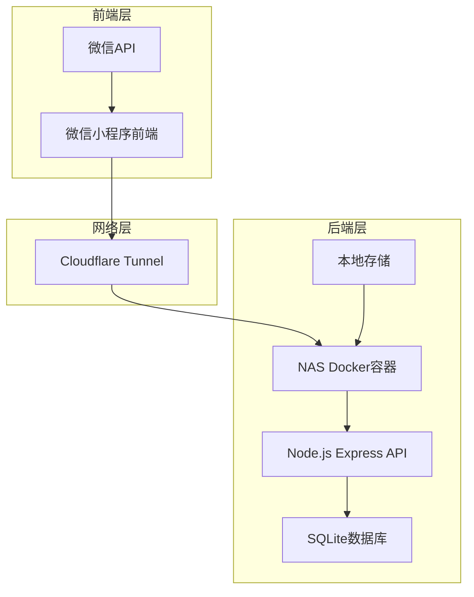

# 设计文档

## 概述

微信小程序新年抽签应用采用前后端分离架构，前端使用uni-app + Vue3 + TypeScript开发微信小程序，后端使用Node.js + Express + SQLite提供API服务，通过Docker容器化部署在NAS上，并通过Cloudflare Tunnel提供HTTPS访问。

系统核心功能包括：节日氛围的首页展示、随机抽签逻辑、结果页动画展示、防刷机制、微信分享功能等。

## 架构

### 整体架构图



### 技术栈选择

**前端技术栈：**
- uni-app：跨平台开发框架，支持小程序和H5
- Vue 3：现代化前端框架，支持Composition API
- TypeScript：类型安全的JavaScript超集
- Pinia：Vue 3状态管理库
- uni-ui：uni-app官方UI组件库

**后端技术栈：**
- Node.js 18+：JavaScript运行时环境
- Express 4.x：轻量级Web框架
- SQLite 3：嵌入式关系数据库
- better-sqlite3：高性能SQLite Node.js驱动
- cors：跨域资源共享中间件

**部署技术栈：**
- Docker：容器化部署
- Cloudflare Tunnel：HTTPS域名代理
- Docker Volume：数据持久化

## 组件和接口

### 前端组件树

```
App.vue
├── pages/
│   ├── index/
│   │   └── index.vue (首页)
│   └── result/
│       └── result.vue (结果页)
├── components/
│   ├── AnimatedBackground.vue (动画背景)
│   ├── FortuneButton.vue (抽签按钮)
│   ├── FortuneResult.vue (运势结果展示)
│   ├── ShareButton.vue (分享按钮)
│   ├── NewYearDecoration.vue (新年装饰元素)
│   └── CountdownTimer.vue (冷却倒计时)
├── stores/
│   ├── user.ts (用户状态管理)
│   └── fortune.ts (抽签状态管理)
├── utils/
│   ├── api.ts (API调用封装)
│   ├── auth.ts (微信登录处理)
│   └── constants.ts (常量定义)
├── styles/
│   ├── theme.scss (新年主题样式)
│   ├── animations.scss (动画效果)
│   └── components.scss (组件样式)
└── types/
    └── index.ts (TypeScript类型定义)
```

## UI设计规范

### 新年主题色彩方案

#### 1. 主色调配置
```scss
// styles/theme.scss
$primary-red: #FF4757;      // 中国红
$golden-yellow: #FFD700;    // 金黄色
$festive-orange: #FF6B35;   // 节庆橙
$lucky-green: #2ED573;      // 幸运绿
$deep-red: #C44569;         // 深红色
$warm-white: #FFF8E7;       // 暖白色

// 渐变色配置
$gradient-primary: linear-gradient(135deg, $primary-red 0%, $festive-orange 100%);
$gradient-golden: linear-gradient(135deg, $golden-yellow 0%, #FFA502 100%);
$gradient-background: linear-gradient(180deg, #FF4757 0%, #FF6B35 50%, #FFD700 100%);

// 阴影配置
$shadow-red: 0 8px 32px rgba(255, 71, 87, 0.3);
$shadow-golden: 0 8px 32px rgba(255, 215, 0, 0.3);
$shadow-deep: 0 12px 40px rgba(196, 69, 105, 0.4);
```

#### 2. 字体配置
```scss
// 字体家族
$font-primary: 'PingFang SC', 'Hiragino Sans GB', 'Microsoft YaHei', sans-serif;
$font-decorative: 'STKaiti', 'KaiTi', serif; // 楷体用于装饰性文字

// 字体大小
$font-size-hero: 48rpx;     // 主标题
$font-size-large: 36rpx;    // 大标题
$font-size-medium: 28rpx;   // 中等文字
$font-size-small: 24rpx;    // 小文字
$font-size-mini: 20rpx;     // 最小文字
```

### 页面设计详情

#### 1. 首页设计 (index.vue)

```vue
<template>
  <view class="home-container">
    <!-- 动画背景层 -->
    <AnimatedBackground />
    
    <!-- 新年装饰层 -->
    <NewYearDecoration />
    
    <!-- 主内容区 -->
    <view class="main-content">
      <!-- 顶部标题区 -->
      <view class="header-section">
        <text class="app-title">🧧 新年抽签 🧧</text>
        <text class="app-subtitle">2026龙年大吉 · 好运连连</text>
      </view>
      
      <!-- 中央抽签区 -->
      <view class="fortune-section">
        <view class="fortune-container">
          <!-- 装饰性元素 -->
          <view class="decoration-top">
            <text class="decoration-text">🎊 恭喜发财 🎊</text>
          </view>
          
          <!-- 抽签按钮 -->
          <FortuneButton 
            :disabled="isDrawing || cooldownRemaining > 0"
            :cooldown="cooldownRemaining"
            @click="handleDraw"
          />
          
          <!-- 装饰性元素 -->
          <view class="decoration-bottom">
            <text class="decoration-text">🎉 万事如意 🎉</text>
          </view>
        </view>
      </view>
      
      <!-- 底部信息区 -->
      <view class="info-section">
        <text class="info-text">轻触上方按钮，抽取您的新年运势</text>
        <text class="info-subtext">每人限抽50次 · 好运不重样</text>
      </view>
    </view>
  </view>
</template>

<style lang="scss" scoped>
.home-container {
  min-height: 100vh;
  background: $gradient-background;
  position: relative;
  overflow: hidden;
}

.main-content {
  position: relative;
  z-index: 10;
  padding: 80rpx 40rpx;
  display: flex;
  flex-direction: column;
  align-items: center;
  min-height: 100vh;
}

.header-section {
  text-align: center;
  margin-bottom: 120rpx;
  
  .app-title {
    font-size: $font-size-hero;
    font-weight: bold;
    color: $warm-white;
    text-shadow: 2px 2px 8px rgba(0, 0, 0, 0.3);
    display: block;
    margin-bottom: 20rpx;
    font-family: $font-decorative;
  }
  
  .app-subtitle {
    font-size: $font-size-medium;
    color: rgba(255, 255, 255, 0.9);
    text-shadow: 1px 1px 4px rgba(0, 0, 0, 0.2);
  }
}

.fortune-section {
  flex: 1;
  display: flex;
  align-items: center;
  justify-content: center;
}

.fortune-container {
  position: relative;
  padding: 60rpx;
  
  .decoration-top,
  .decoration-bottom {
    text-align: center;
    margin: 40rpx 0;
    
    .decoration-text {
      font-size: $font-size-large;
      color: $golden-yellow;
      text-shadow: 2px 2px 6px rgba(0, 0, 0, 0.3);
      font-weight: bold;
    }
  }
}

.info-section {
  text-align: center;
  margin-top: 80rpx;
  
  .info-text {
    font-size: $font-size-medium;
    color: rgba(255, 255, 255, 0.9);
    display: block;
    margin-bottom: 16rpx;
  }
  
  .info-subtext {
    font-size: $font-size-small;
    color: rgba(255, 255, 255, 0.7);
  }
}
</style>
```

#### 2. 抽签按钮组件 (FortuneButton.vue)

```vue
<template>
  <view class="fortune-button-container">
    <button 
      class="fortune-button"
      :class="{ 
        'disabled': disabled,
        'drawing': isDrawing,
        'cooldown': cooldownRemaining > 0
      }"
      @click="handleClick"
      :disabled="disabled"
    >
      <!-- 按钮背景装饰 -->
      <view class="button-decoration">
        <view class="decoration-ring"></view>
        <view class="decoration-sparkles">
          <text class="sparkle">✨</text>
          <text class="sparkle">⭐</text>
          <text class="sparkle">💫</text>
          <text class="sparkle">🌟</text>
        </view>
      </view>
      
      <!-- 按钮内容 -->
      <view class="button-content">
        <view v-if="cooldownRemaining > 0" class="cooldown-content">
          <text class="cooldown-number">{{ cooldownRemaining }}</text>
          <text class="cooldown-text">秒后可再抽</text>
        </view>
        <view v-else-if="isDrawing" class="drawing-content">
          <text class="drawing-text">抽签中...</text>
          <view class="loading-dots">
            <view class="dot"></view>
            <view class="dot"></view>
            <view class="dot"></view>
          </view>
        </view>
        <view v-else class="normal-content">
          <text class="button-text">🎲 抽 签 🎲</text>
          <text class="button-subtext">点击获取新年运势</text>
        </view>
      </view>
    </button>
  </view>
</template>

<style lang="scss" scoped>
.fortune-button-container {
  position: relative;
  display: flex;
  justify-content: center;
  align-items: center;
}

.fortune-button {
  width: 320rpx;
  height: 320rpx;
  border-radius: 50%;
  border: none;
  background: $gradient-golden;
  box-shadow: $shadow-golden;
  position: relative;
  overflow: hidden;
  transition: all 0.3s ease;
  
  &:not(.disabled):active {
    transform: scale(0.95);
    box-shadow: 0 4px 20px rgba(255, 215, 0, 0.4);
  }
  
  &.disabled {
    opacity: 0.6;
    transform: none !important;
  }
  
  &.drawing {
    animation: pulse 1.5s infinite;
  }
  
  &.cooldown {
    background: linear-gradient(135deg, #95A5A6 0%, #7F8C8D 100%);
    box-shadow: 0 8px 32px rgba(127, 140, 141, 0.3);
  }
}

.button-decoration {
  position: absolute;
  top: 0;
  left: 0;
  right: 0;
  bottom: 0;
  
  .decoration-ring {
    position: absolute;
    top: 20rpx;
    left: 20rpx;
    right: 20rpx;
    bottom: 20rpx;
    border: 4rpx solid rgba(255, 255, 255, 0.3);
    border-radius: 50%;
    animation: rotate 8s linear infinite;
  }
  
  .decoration-sparkles {
    position: absolute;
    top: 0;
    left: 0;
    right: 0;
    bottom: 0;
    
    .sparkle {
      position: absolute;
      font-size: 32rpx;
      animation: sparkle 2s ease-in-out infinite;
      
      &:nth-child(1) {
        top: 20rpx;
        left: 50%;
        transform: translateX(-50%);
        animation-delay: 0s;
      }
      
      &:nth-child(2) {
        top: 50%;
        right: 20rpx;
        transform: translateY(-50%);
        animation-delay: 0.5s;
      }
      
      &:nth-child(3) {
        bottom: 20rpx;
        left: 50%;
        transform: translateX(-50%);
        animation-delay: 1s;
      }
      
      &:nth-child(4) {
        top: 50%;
        left: 20rpx;
        transform: translateY(-50%);
        animation-delay: 1.5s;
      }
    }
  }
}

.button-content {
  position: relative;
  z-index: 2;
  display: flex;
  flex-direction: column;
  align-items: center;
  justify-content: center;
  height: 100%;
  color: $deep-red;
}

.normal-content {
  text-align: center;
  
  .button-text {
    font-size: $font-size-large;
    font-weight: bold;
    display: block;
    margin-bottom: 12rpx;
    font-family: $font-decorative;
  }
  
  .button-subtext {
    font-size: $font-size-small;
    opacity: 0.8;
  }
}

.cooldown-content {
  text-align: center;
  
  .cooldown-number {
    font-size: 72rpx;
    font-weight: bold;
    display: block;
    color: #fff;
  }
  
  .cooldown-text {
    font-size: $font-size-small;
    color: rgba(255, 255, 255, 0.8);
  }
}

.drawing-content {
  text-align: center;
  
  .drawing-text {
    font-size: $font-size-large;
    font-weight: bold;
    display: block;
    margin-bottom: 20rpx;
  }
  
  .loading-dots {
    display: flex;
    gap: 8rpx;
    
    .dot {
      width: 12rpx;
      height: 12rpx;
      border-radius: 50%;
      background: $deep-red;
      animation: bounce 1.4s ease-in-out infinite both;
      
      &:nth-child(1) { animation-delay: -0.32s; }
      &:nth-child(2) { animation-delay: -0.16s; }
      &:nth-child(3) { animation-delay: 0s; }
    }
  }
}

// 动画定义
@keyframes pulse {
  0%, 100% { transform: scale(1); }
  50% { transform: scale(1.05); }
}

@keyframes rotate {
  from { transform: rotate(0deg); }
  to { transform: rotate(360deg); }
}

@keyframes sparkle {
  0%, 100% { opacity: 0.3; transform: scale(1); }
  50% { opacity: 1; transform: scale(1.2); }
}

@keyframes bounce {
  0%, 80%, 100% { transform: scale(0); }
  40% { transform: scale(1); }
}
</style>
```

#### 3. 动画背景组件 (AnimatedBackground.vue)

```vue
<template>
  <view class="animated-background">
    <!-- 飘雪效果 -->
    <view class="snow-container">
      <view 
        v-for="(snow, index) in snowflakes" 
        :key="index"
        class="snowflake"
        :style="snow.style"
      >
        {{ snow.symbol }}
      </view>
    </view>
    
    <!-- 烟花效果 -->
    <view class="fireworks-container">
      <view 
        v-for="(firework, index) in fireworks"
        :key="index"
        class="firework"
        :style="firework.style"
      >
        <view class="firework-spark"></view>
      </view>
    </view>
    
    <!-- 浮动装饰 -->
    <view class="floating-decorations">
      <view class="decoration lantern">🏮</view>
      <view class="decoration coin">🪙</view>
      <view class="decoration dragon">🐉</view>
      <view class="decoration blessing">福</view>
    </view>
  </view>
</template>

<script setup lang="ts">
import { ref, onMounted, onUnmounted } from 'vue';

interface Snowflake {
  symbol: string;
  style: Record<string, string>;
}

interface Firework {
  style: Record<string, string>;
}

const snowflakes = ref<Snowflake[]>([]);
const fireworks = ref<Firework[]>([]);

// 雪花符号池
const snowSymbols = ['❄️', '⭐', '✨', '🌟', '💫'];

// 创建雪花
function createSnowflake(): Snowflake {
  const symbol = snowSymbols[Math.floor(Math.random() * snowSymbols.length)];
  const left = Math.random() * 100;
  const animationDuration = 3 + Math.random() * 4; // 3-7秒
  const size = 0.8 + Math.random() * 0.4; // 0.8-1.2倍
  
  return {
    symbol,
    style: {
      left: `${left}%`,
      animationDuration: `${animationDuration}s`,
      fontSize: `${24 * size}rpx`,
      animationDelay: `${Math.random() * 2}s`
    }
  };
}

// 创建烟花
function createFirework(): Firework {
  const left = Math.random() * 100;
  const top = Math.random() * 60 + 20; // 20%-80%的位置
  
  return {
    style: {
      left: `${left}%`,
      top: `${top}%`,
      animationDelay: `${Math.random() * 3}s`
    }
  };
}

// 初始化动画
function initAnimations() {
  // 创建雪花
  for (let i = 0; i < 20; i++) {
    snowflakes.value.push(createSnowflake());
  }
  
  // 创建烟花
  for (let i = 0; i < 8; i++) {
    fireworks.value.push(createFirework());
  }
}

onMounted(() => {
  initAnimations();
});
</script>

<style lang="scss" scoped>
.animated-background {
  position: fixed;
  top: 0;
  left: 0;
  width: 100%;
  height: 100%;
  pointer-events: none;
  z-index: 1;
  overflow: hidden;
}

.snow-container {
  position: absolute;
  top: -100rpx;
  left: 0;
  width: 100%;
  height: calc(100% + 100rpx);
  
  .snowflake {
    position: absolute;
    top: -50rpx;
    color: rgba(255, 255, 255, 0.8);
    animation: snowfall linear infinite;
    text-shadow: 0 0 10rpx rgba(255, 255, 255, 0.5);
  }
}

.fireworks-container {
  position: absolute;
  top: 0;
  left: 0;
  width: 100%;
  height: 100%;
  
  .firework {
    position: absolute;
    width: 8rpx;
    height: 8rpx;
    
    .firework-spark {
      width: 100%;
      height: 100%;
      background: radial-gradient(circle, $golden-yellow 0%, transparent 70%);
      border-radius: 50%;
      animation: firework-explosion 2s ease-out infinite;
    }
  }
}

.floating-decorations {
  position: absolute;
  top: 0;
  left: 0;
  width: 100%;
  height: 100%;
  
  .decoration {
    position: absolute;
    font-size: 48rpx;
    animation: float 6s ease-in-out infinite;
    
    &.lantern {
      top: 15%;
      left: 10%;
      animation-delay: 0s;
    }
    
    &.coin {
      top: 25%;
      right: 15%;
      animation-delay: 1.5s;
    }
    
    &.dragon {
      bottom: 30%;
      left: 8%;
      animation-delay: 3s;
    }
    
    &.blessing {
      bottom: 20%;
      right: 12%;
      color: $primary-red;
      font-weight: bold;
      font-family: $font-decorative;
      animation-delay: 4.5s;
    }
  }
}

// 动画定义
@keyframes snowfall {
  0% {
    transform: translateY(-100rpx) rotate(0deg);
    opacity: 0;
  }
  10% {
    opacity: 1;
  }
  90% {
    opacity: 1;
  }
  100% {
    transform: translateY(calc(100vh + 100rpx)) rotate(360deg);
    opacity: 0;
  }
}

@keyframes firework-explosion {
  0% {
    transform: scale(0);
    opacity: 1;
  }
  50% {
    transform: scale(1);
    opacity: 0.8;
  }
  100% {
    transform: scale(2);
    opacity: 0;
  }
}

@keyframes float {
  0%, 100% {
    transform: translateY(0px) rotate(0deg);
  }
  33% {
    transform: translateY(-20rpx) rotate(5deg);
  }
  66% {
    transform: translateY(10rpx) rotate(-3deg);
  }
}
</style>
```

#### 4. 结果页设计 (result.vue)

```vue
<template>
  <view class="result-container">
    <!-- 背景效果 -->
    <view class="result-background">
      <view class="golden-rays"></view>
      <view class="celebration-particles">
        <view v-for="i in 12" :key="i" class="particle" :style="getParticleStyle(i)">
          {{ getParticleSymbol(i) }}
        </view>
      </view>
    </view>
    
    <!-- 主内容 -->
    <view class="result-content">
      <!-- 顶部装饰 -->
      <view class="result-header">
        <text class="result-title">🎊 恭喜您 🎊</text>
        <text class="result-subtitle">获得新年好运势</text>
      </view>
      
      <!-- 运势卡片 -->
      <view class="fortune-card">
        <view class="card-decoration-top">
          <text class="decoration-symbol">🌟</text>
          <text class="decoration-symbol">✨</text>
          <text class="decoration-symbol">🌟</text>
        </view>
        
        <view class="fortune-content">
          <text class="fortune-text">{{ fortuneText }}</text>
        </view>
        
        <view class="card-decoration-bottom">
          <text class="blessing-text">龙年大吉 · 万事如意</text>
        </view>
      </view>
      
      <!-- 操作按钮区 -->
      <view class="action-buttons">
        <button class="share-button" @click="handleShare">
          <text class="button-icon">📤</text>
          <text class="button-text">分享好友</text>
        </button>
        
        <button 
          class="draw-again-button" 
          :class="{ disabled: cooldownRemaining > 0 }"
          @click="handleDrawAgain"
          :disabled="cooldownRemaining > 0"
        >
          <text v-if="cooldownRemaining > 0" class="button-text">
            {{ cooldownRemaining }}秒后可再抽
          </text>
          <text v-else class="button-text">
            <text class="button-icon">🎲</text>
            再抽一次
          </text>
        </button>
      </view>
      
      <!-- 底部信息 -->
      <view class="result-footer">
        <text class="footer-text">愿您新年快乐，好运连连！</text>
      </view>
    </view>
  </view>
</template>

<style lang="scss" scoped>
.result-container {
  min-height: 100vh;
  background: $gradient-background;
  position: relative;
  overflow: hidden;
}

.result-background {
  position: absolute;
  top: 0;
  left: 0;
  width: 100%;
  height: 100%;
  
  .golden-rays {
    position: absolute;
    top: 50%;
    left: 50%;
    width: 600rpx;
    height: 600rpx;
    transform: translate(-50%, -50%);
    background: radial-gradient(circle, 
      rgba(255, 215, 0, 0.3) 0%, 
      rgba(255, 215, 0, 0.1) 50%, 
      transparent 70%);
    animation: rotate 20s linear infinite;
  }
  
  .celebration-particles {
    position: absolute;
    top: 0;
    left: 0;
    width: 100%;
    height: 100%;
    
    .particle {
      position: absolute;
      font-size: 32rpx;
      animation: celebrate 3s ease-in-out infinite;
    }
  }
}

.result-content {
  position: relative;
  z-index: 10;
  padding: 80rpx 40rpx;
  display: flex;
  flex-direction: column;
  align-items: center;
  min-height: 100vh;
}

.result-header {
  text-align: center;
  margin-bottom: 80rpx;
  
  .result-title {
    font-size: $font-size-hero;
    font-weight: bold;
    color: $warm-white;
    text-shadow: 2px 2px 8px rgba(0, 0, 0, 0.3);
    display: block;
    margin-bottom: 20rpx;
    font-family: $font-decorative;
  }
  
  .result-subtitle {
    font-size: $font-size-large;
    color: rgba(255, 255, 255, 0.9);
    text-shadow: 1px 1px 4px rgba(0, 0, 0, 0.2);
  }
}

.fortune-card {
  background: rgba(255, 255, 255, 0.95);
  border-radius: 32rpx;
  padding: 60rpx 40rpx;
  margin-bottom: 80rpx;
  box-shadow: $shadow-deep;
  border: 4rpx solid $golden-yellow;
  position: relative;
  animation: cardGlow 2s ease-in-out infinite alternate;
  
  .card-decoration-top {
    text-align: center;
    margin-bottom: 40rpx;
    
    .decoration-symbol {
      font-size: 40rpx;
      margin: 0 20rpx;
      animation: sparkle 1.5s ease-in-out infinite;
      
      &:nth-child(2) {
        animation-delay: 0.5s;
      }
      
      &:nth-child(3) {
        animation-delay: 1s;
      }
    }
  }
  
  .fortune-content {
    text-align: center;
    margin: 40rpx 0;
    
    .fortune-text {
      font-size: $font-size-large;
      color: $deep-red;
      font-weight: bold;
      line-height: 1.6;
      font-family: $font-decorative;
    }
  }
  
  .card-decoration-bottom {
    text-align: center;
    margin-top: 40rpx;
    
    .blessing-text {
      font-size: $font-size-medium;
      color: $primary-red;
      font-weight: bold;
    }
  }
}

.action-buttons {
  display: flex;
  gap: 40rpx;
  margin-bottom: 60rpx;
  
  button {
    flex: 1;
    height: 100rpx;
    border-radius: 50rpx;
    border: none;
    font-size: $font-size-medium;
    font-weight: bold;
    display: flex;
    align-items: center;
    justify-content: center;
    gap: 16rpx;
    transition: all 0.3s ease;
    
    &:active:not(.disabled) {
      transform: scale(0.95);
    }
    
    .button-icon {
      font-size: $font-size-large;
    }
  }
  
  .share-button {
    background: $gradient-primary;
    color: white;
    box-shadow: $shadow-red;
  }
  
  .draw-again-button {
    background: $gradient-golden;
    color: $deep-red;
    box-shadow: $shadow-golden;
    
    &.disabled {
      background: linear-gradient(135deg, #BDC3C7 0%, #95A5A6 100%);
      color: #7F8C8D;
      box-shadow: none;
    }
  }
}

.result-footer {
  text-align: center;
  margin-top: auto;
  
  .footer-text {
    font-size: $font-size-medium;
    color: rgba(255, 255, 255, 0.8);
    font-family: $font-decorative;
  }
}

// 动画定义
@keyframes cardGlow {
  0% { box-shadow: $shadow-deep; }
  100% { box-shadow: 0 12px 40px rgba(255, 215, 0, 0.6); }
}

@keyframes celebrate {
  0%, 100% {
    transform: translateY(0) rotate(0deg);
    opacity: 0.7;
  }
  50% {
    transform: translateY(-30rpx) rotate(180deg);
    opacity: 1;
  }
}
</style>
```

### 响应式设计适配

#### 1. 屏幕尺寸适配
```scss
// styles/responsive.scss

// iPhone SE (375px)
@media screen and (max-width: 375px) {
  .fortune-button {
    width: 280rpx;
    height: 280rpx;
  }
  
  .app-title {
    font-size: 40rpx;
  }
}

// iPhone 12/13/14 (390px)
@media screen and (min-width: 376px) and (max-width: 430px) {
  .fortune-button {
    width: 320rpx;
    height: 320rpx;
  }
}

// iPhone 12/13/14 Pro Max (428px)
@media screen and (min-width: 431px) {
  .fortune-button {
    width: 360rpx;
    height: 360rpx;
  }
  
  .app-title {
    font-size: 52rpx;
  }
}

// 安卓大屏适配
@media screen and (min-width: 480px) {
  .main-content {
    max-width: 750rpx;
    margin: 0 auto;
  }
}
```

#### 2. 安全区域适配
```scss
// 适配刘海屏和底部安全区域
.home-container,
.result-container {
  padding-top: constant(safe-area-inset-top);
  padding-top: env(safe-area-inset-top);
  padding-bottom: constant(safe-area-inset-bottom);
  padding-bottom: env(safe-area-inset-bottom);
}
```

### 后端API接口

#### 1. 抽签接口

**端点：** `POST /api/fortune`

**请求体：**
```typescript
interface FortuneRequest {
  openid: string;
}
```

**响应体：**
```typescript
interface FortuneResponse {
  success: boolean;
  data?: {
    id: number;
    text: string;
    isNew: boolean;
  };
  error?: string;
  cooldown?: number; // 剩余冷却时间（秒）
}
```

**业务逻辑：**
1. 验证openid格式
2. 检查用户抽签冷却时间（10秒间隔）
3. 查询用户已抽过的运势ID列表
4. 从运势池中排除已抽过的运势
5. 随机选择一条可用运势
6. 记录抽签记录到数据库
7. 返回运势信息

#### 2. 健康检查接口

**端点：** `GET /api/health`

**响应体：**
```typescript
interface HealthResponse {
  status: 'ok';
  timestamp: string;
  database: 'connected' | 'error';
}
```

### 微信小程序API集成

#### 1. 用户登录流程

```typescript
// 获取微信登录凭证
wx.login({
  success: (res) => {
    if (res.code) {
      // 发送code到后端换取openid
      // 注意：实际项目中需要后端调用微信API
      // 这里简化为直接使用wx.getUserProfile获取用户信息
    }
  }
});
```

#### 2. 分享功能

```typescript
// 分享给好友
wx.shareAppMessage({
  title: '我抽到了新年好运势！',
  path: '/pages/index/index',
  imageUrl: '/static/share-image.png'
});
```

## 数据模型

### SQLite数据库设计

#### 1. 运势表 (fortunes)

```sql
CREATE TABLE fortunes (
  id INTEGER PRIMARY KEY AUTOINCREMENT,
  text TEXT NOT NULL UNIQUE,
  category VARCHAR(50) DEFAULT 'general',
  created_at DATETIME DEFAULT CURRENT_TIMESTAMP
);
```

**字段说明：**
- `id`: 运势唯一标识符
- `text`: 运势文本内容
- `category`: 运势分类（财运、事业、爱情等）
- `created_at`: 创建时间

#### 2. 用户抽签记录表 (user_draws)

```sql
CREATE TABLE user_draws (
  id INTEGER PRIMARY KEY AUTOINCREMENT,
  openid VARCHAR(100) NOT NULL,
  fortune_id INTEGER NOT NULL,
  timestamp DATETIME DEFAULT CURRENT_TIMESTAMP,
  FOREIGN KEY (fortune_id) REFERENCES fortunes(id),
  UNIQUE(openid, fortune_id)
);
```

**字段说明：**
- `id`: 记录唯一标识符
- `openid`: 微信用户唯一标识
- `fortune_id`: 抽中的运势ID
- `timestamp`: 抽签时间戳

**索引设计：**
```sql
CREATE INDEX idx_user_draws_openid ON user_draws(openid);
CREATE INDEX idx_user_draws_timestamp ON user_draws(timestamp);
```

#### 3. 预设运势数据

```sql
INSERT INTO fortunes (text, category) VALUES
('2026年财运爆棚，金银满屋！', 'wealth'),
('新年新气象，事业蒸蒸日上！', 'career'),
('桃花朵朵开，爱情甜如蜜！', 'love'),
('身体健康，万事如意！', 'health'),
('学业有成，智慧满满！', 'study'),
-- ... 共50条运势数据
;
```

### 前端数据模型

#### 1. 用户状态接口

```typescript
interface UserState {
  openid: string | null;
  isLoggedIn: boolean;
  lastDrawTime: number | null;
  cooldownRemaining: number;
}
```

#### 2. 抽签状态接口

```typescript
interface FortuneState {
  currentFortune: Fortune | null;
  isDrawing: boolean;
  drawHistory: Fortune[];
  availableCount: number;
}

interface Fortune {
  id: number;
  text: string;
  category: string;
  isNew: boolean;
  timestamp: number;
}
```

## 正确性属性

*属性是一个特征或行为，应该在系统的所有有效执行中保持为真——本质上是关于系统应该做什么的正式声明。属性作为人类可读规范和机器可验证正确性保证之间的桥梁。*

基于对验收标准的分析，以下是系统必须满足的正确性属性：

### 属性 1: 响应式布局适配
*对于任何*屏幕尺寸和设备类型，小程序界面应该正确适配并保持良好的用户体验
**验证需求：需求 1.4**

### 属性 2: 运势随机选择正确性
*对于任何*用户的抽签请求，系统返回的运势必须来自预设的运势池，且不能是该用户已经抽过的运势
**验证需求：需求 2.1, 2.4**

### 属性 3: 运势ID唯一性
*对于任何*运势记录，其ID必须在整个系统中保持唯一
**验证需求：需求 2.3**

### 属性 4: 用户身份识别一致性
*对于任何*API请求，系统必须通过openid正确识别用户身份，且同一openid在所有请求中代表同一用户
**验证需求：需求 2.5, 8.3**

### 属性 5: API请求格式验证
*对于任何*发送到`/api/fortune`的请求，系统必须验证请求包含有效的openid字段
**验证需求：需求 5.2**

### 属性 6: API响应格式一致性
*对于任何*成功的抽签请求，API响应必须包含id、text、isNew三个必需字段
**验证需求：需求 5.3**

### 属性 7: 抽签冷却机制
*对于任何*用户的连续抽签请求，如果时间间隔少于10秒，系统必须拒绝请求并记录正确的时间戳
**验证需求：需求 4.1, 4.2, 4.3, 4.4**

### 属性 8: 抽签记录完整性
*对于任何*成功的抽签操作，数据库中必须创建包含openid、fortune_id、timestamp的完整记录
**验证需求：需求 6.2, 6.3**

### 属性 9: 用户历史查询准确性
*对于任何*用户openid，查询其抽签历史必须返回该用户的所有抽签记录，且不包含其他用户的记录
**验证需求：需求 6.5**

<function_calls>
<invoke name="prework">
<parameter name="featureName">wechat-fortune-draw

## 错误处理

### 前端错误处理

#### 1. 网络错误处理
```typescript
// API调用错误处理
async function callFortuneAPI(openid: string): Promise<FortuneResponse> {
  try {
    const response = await uni.request({
      url: `${API_BASE_URL}/api/fortune`,
      method: 'POST',
      data: { openid },
      timeout: 10000
    });
    
    if (response.statusCode !== 200) {
      throw new Error(`HTTP ${response.statusCode}: ${response.data?.error || '服务器错误'}`);
    }
    
    return response.data;
  } catch (error) {
    // 网络错误处理
    if (error.errMsg?.includes('timeout')) {
      throw new Error('网络超时，请检查网络连接');
    } else if (error.errMsg?.includes('fail')) {
      throw new Error('网络连接失败，请稍后重试');
    }
    throw error;
  }
}
```

#### 2. 用户交互错误处理
```typescript
// 抽签冷却期处理
function handleDrawCooldown(cooldownSeconds: number) {
  uni.showToast({
    title: `请等待 ${cooldownSeconds} 秒后再抽签`,
    icon: 'none',
    duration: 2000
  });
  
  // 启动倒计时显示
  startCooldownTimer(cooldownSeconds);
}

// 微信登录失败处理
function handleLoginError(error: any) {
  console.error('微信登录失败:', error);
  uni.showModal({
    title: '登录失败',
    content: '无法获取微信用户信息，请重试',
    showCancel: false,
    confirmText: '重试',
    success: () => {
      // 重新尝试登录
      performWeChatLogin();
    }
  });
}
```

### 后端错误处理

#### 1. 请求验证错误
```typescript
// 输入验证中间件
function validateFortuneRequest(req: Request, res: Response, next: NextFunction) {
  const { openid } = req.body;
  
  if (!openid) {
    return res.status(400).json({
      success: false,
      error: '缺少必需参数: openid'
    });
  }
  
  if (typeof openid !== 'string' || openid.length < 10) {
    return res.status(400).json({
      success: false,
      error: 'openid格式无效'
    });
  }
  
  next();
}
```

#### 2. 数据库错误处理
```typescript
// 数据库操作错误处理
async function drawFortune(openid: string): Promise<FortuneResponse> {
  try {
    // 检查冷却时间
    const lastDraw = await getLastDrawTime(openid);
    const cooldownRemaining = checkCooldown(lastDraw);
    
    if (cooldownRemaining > 0) {
      return {
        success: false,
        error: '抽签冷却中',
        cooldown: cooldownRemaining
      };
    }
    
    // 获取可用运势
    const availableFortunes = await getAvailableFortunes(openid);
    
    if (availableFortunes.length === 0) {
      return {
        success: false,
        error: '您已经抽完了所有运势！'
      };
    }
    
    // 随机选择并记录
    const selectedFortune = selectRandomFortune(availableFortunes);
    await recordDraw(openid, selectedFortune.id);
    
    return {
      success: true,
      data: {
        id: selectedFortune.id,
        text: selectedFortune.text,
        isNew: true
      }
    };
    
  } catch (error) {
    console.error('抽签操作失败:', error);
    
    if (error.code === 'SQLITE_CONSTRAINT') {
      return {
        success: false,
        error: '数据冲突，请重试'
      };
    }
    
    return {
      success: false,
      error: '服务器内部错误'
    };
  }
}
```

#### 3. 全局错误处理
```typescript
// Express全局错误处理中间件
function globalErrorHandler(err: Error, req: Request, res: Response, next: NextFunction) {
  console.error('未处理的错误:', err);
  
  // 数据库连接错误
  if (err.message.includes('SQLITE')) {
    return res.status(500).json({
      success: false,
      error: '数据库服务暂时不可用'
    });
  }
  
  // 默认错误响应
  res.status(500).json({
    success: false,
    error: '服务器内部错误'
  });
}
```

## 测试策略

### 双重测试方法

本项目采用**单元测试**和**属性测试**相结合的综合测试策略：

- **单元测试**：验证特定示例、边界情况和错误条件
- **属性测试**：验证通用属性在所有输入中的正确性
- **集成测试**：验证组件间交互和端到端流程

两种测试方法互补，确保全面覆盖：单元测试捕获具体错误，属性测试验证通用正确性。

### 前端测试策略

#### 1. 单元测试框架
- **测试框架**：Jest + Vue Test Utils
- **覆盖范围**：组件渲染、用户交互、状态管理
- **测试文件位置**：`tests/unit/`

#### 2. 组件测试示例
```typescript
// tests/unit/FortuneButton.test.ts
describe('FortuneButton组件', () => {
  test('应该显示抽签按钮', () => {
    const wrapper = mount(FortuneButton);
    expect(wrapper.find('.fortune-button').exists()).toBe(true);
    expect(wrapper.text()).toContain('抽签');
  });
  
  test('冷却期间应该禁用按钮', () => {
    const wrapper = mount(FortuneButton, {
      props: { disabled: true, cooldown: 5 }
    });
    expect(wrapper.find('.fortune-button').attributes('disabled')).toBeDefined();
    expect(wrapper.text()).toContain('5');
  });
});
```

#### 3. 属性测试配置
- **测试库**：fast-check
- **最小迭代次数**：100次
- **测试标签格式**：**Feature: wechat-fortune-draw, Property {number}: {property_text}**

### 后端测试策略

#### 1. 单元测试框架
- **测试框架**：Jest + Supertest
- **数据库**：内存SQLite用于测试
- **覆盖范围**：API端点、业务逻辑、数据库操作

#### 2. API测试示例
```typescript
// tests/unit/fortune.test.ts
describe('抽签API', () => {
  test('应该返回有效的运势数据', async () => {
    const response = await request(app)
      .post('/api/fortune')
      .send({ openid: 'test_openid_123' })
      .expect(200);
    
    expect(response.body.success).toBe(true);
    expect(response.body.data).toHaveProperty('id');
    expect(response.body.data).toHaveProperty('text');
    expect(response.body.data).toHaveProperty('isNew');
  });
  
  test('应该拒绝无效的openid', async () => {
    const response = await request(app)
      .post('/api/fortune')
      .send({ openid: '' })
      .expect(400);
    
    expect(response.body.success).toBe(false);
    expect(response.body.error).toContain('openid');
  });
});
```

#### 3. 属性测试实现
```typescript
// tests/property/fortune.property.test.ts
import fc from 'fast-check';

describe('抽签系统属性测试', () => {
  test('属性2: 运势随机选择正确性', () => {
    // **Feature: wechat-fortune-draw, Property 2: 运势随机选择正确性**
    fc.assert(fc.property(
      fc.string({ minLength: 10, maxLength: 50 }), // 生成有效openid
      async (openid) => {
        const response = await drawFortune(openid);
        if (response.success) {
          // 验证返回的运势来自运势池
          const allFortunes = await getAllFortunes();
          const fortuneIds = allFortunes.map(f => f.id);
          expect(fortuneIds).toContain(response.data.id);
          
          // 验证用户未抽过此运势
          const userHistory = await getUserDrawHistory(openid);
          const previousIds = userHistory.map(h => h.fortune_id);
          expect(previousIds).not.toContain(response.data.id);
        }
      }
    ), { numRuns: 100 });
  });
  
  test('属性7: 抽签冷却机制', () => {
    // **Feature: wechat-fortune-draw, Property 7: 抽签冷却机制**
    fc.assert(fc.property(
      fc.string({ minLength: 10, maxLength: 50 }),
      async (openid) => {
        // 第一次抽签
        const firstDraw = await drawFortune(openid);
        
        // 立即第二次抽签
        const secondDraw = await drawFortune(openid);
        
        // 验证冷却机制
        if (firstDraw.success) {
          expect(secondDraw.success).toBe(false);
          expect(secondDraw.cooldown).toBeGreaterThan(0);
          expect(secondDraw.cooldown).toBeLessThanOrEqual(10);
        }
      }
    ), { numRuns: 100 });
  });
});
```

### 集成测试策略

#### 1. 端到端测试
- **测试工具**：Playwright（用于H5版本测试）
- **测试范围**：完整用户流程、跨组件交互

#### 2. Docker容器测试
```dockerfile
# Dockerfile.test - 测试环境容器
FROM node:18-alpine
WORKDIR /app
COPY package*.json ./
RUN npm ci
COPY . .
RUN npm run test
RUN npm run build
```

### 测试执行配置

#### 1. 测试脚本配置
```json
{
  "scripts": {
    "test": "jest",
    "test:unit": "jest tests/unit",
    "test:property": "jest tests/property",
    "test:integration": "jest tests/integration",
    "test:coverage": "jest --coverage",
    "test:watch": "jest --watch"
  }
}
```

#### 2. Jest配置
```javascript
// jest.config.js
module.exports = {
  testEnvironment: 'node',
  roots: ['<rootDir>/src', '<rootDir>/tests'],
  testMatch: ['**/__tests__/**/*.ts', '**/?(*.)+(spec|test).ts'],
  transform: {
    '^.+\\.ts$': 'ts-jest'
  },
  collectCoverageFrom: [
    'src/**/*.ts',
    '!src/**/*.d.ts',
    '!src/types/**/*'
  ],
  coverageThreshold: {
    global: {
      branches: 80,
      functions: 80,
      lines: 80,
      statements: 80
    }
  }
};
```

## Docker部署方案

### 1. Dockerfile设计

```dockerfile
# 多阶段构建 - 构建阶段
FROM node:18-alpine AS builder

WORKDIR /app

# 复制依赖文件
COPY package*.json ./
RUN npm ci --only=production

# 复制源代码
COPY src/ ./src/
COPY tsconfig.json ./

# 构建应用
RUN npm run build

# 生产阶段
FROM node:18-alpine AS production

WORKDIR /app

# 创建非root用户
RUN addgroup -g 1001 -S nodejs && \
    adduser -S nodejs -u 1001

# 复制构建产物和依赖
COPY --from=builder /app/node_modules ./node_modules
COPY --from=builder /app/dist ./dist
COPY --from=builder /app/package*.json ./

# 创建数据目录
RUN mkdir -p /app/data && \
    chown -R nodejs:nodejs /app

# 切换到非root用户
USER nodejs

# 暴露端口
EXPOSE 3000

# 健康检查
HEALTHCHECK --interval=30s --timeout=3s --start-period=5s --retries=3 \
  CMD node -e "require('http').get('http://localhost:3000/api/health', (res) => { process.exit(res.statusCode === 200 ? 0 : 1) })"

# 启动命令
CMD ["node", "dist/server.js"]
```

### 2. Docker Compose配置

```yaml
# docker-compose.yml
version: '3.8'

services:
  wechat-fortune-api:
    build:
      context: .
      dockerfile: Dockerfile
    container_name: wechat-fortune-api
    restart: unless-stopped
    ports:
      - "3000:3000"
    volumes:
      # 数据持久化到NAS本地目录
      - /volume1/docker/wechat-fortune/data:/app/data
      - /volume1/docker/wechat-fortune/logs:/app/logs
    environment:
      - NODE_ENV=production
      - PORT=3000
      - DB_PATH=/app/data/fortune.db
      - LOG_LEVEL=info
    networks:
      - fortune-network
    
  # 可选：添加nginx反向代理
  nginx:
    image: nginx:alpine
    container_name: wechat-fortune-nginx
    restart: unless-stopped
    ports:
      - "80:80"
    volumes:
      - ./nginx.conf:/etc/nginx/nginx.conf:ro
    depends_on:
      - wechat-fortune-api
    networks:
      - fortune-network

networks:
  fortune-network:
    driver: bridge

volumes:
  fortune-data:
    driver: local
```

### 3. 数据库初始化脚本

```typescript
// src/database/init.ts
import Database from 'better-sqlite3';
import path from 'path';
import { fortuneData } from './fortune-data';

export function initializeDatabase(dbPath: string): Database.Database {
  const db = new Database(dbPath);
  
  // 启用外键约束
  db.pragma('foreign_keys = ON');
  
  // 创建表结构
  db.exec(`
    CREATE TABLE IF NOT EXISTS fortunes (
      id INTEGER PRIMARY KEY AUTOINCREMENT,
      text TEXT NOT NULL UNIQUE,
      category VARCHAR(50) DEFAULT 'general',
      created_at DATETIME DEFAULT CURRENT_TIMESTAMP
    );
    
    CREATE TABLE IF NOT EXISTS user_draws (
      id INTEGER PRIMARY KEY AUTOINCREMENT,
      openid VARCHAR(100) NOT NULL,
      fortune_id INTEGER NOT NULL,
      timestamp DATETIME DEFAULT CURRENT_TIMESTAMP,
      FOREIGN KEY (fortune_id) REFERENCES fortunes(id),
      UNIQUE(openid, fortune_id)
    );
    
    CREATE INDEX IF NOT EXISTS idx_user_draws_openid ON user_draws(openid);
    CREATE INDEX IF NOT EXISTS idx_user_draws_timestamp ON user_draws(timestamp);
  `);
  
  // 插入初始运势数据
  const insertFortune = db.prepare('INSERT OR IGNORE INTO fortunes (text, category) VALUES (?, ?)');
  const insertMany = db.transaction((fortunes) => {
    for (const fortune of fortunes) {
      insertFortune.run(fortune.text, fortune.category);
    }
  });
  
  insertMany(fortuneData);
  
  console.log('数据库初始化完成');
  return db;
}
```

### 4. Cloudflare Tunnel配置

```yaml
# cloudflared.yml
tunnel: your-tunnel-id
credentials-file: /path/to/credentials.json

ingress:
  - hostname: fortune.yourdomain.com
    service: http://localhost:3000
  - service: http_status:404
```

### 5. 部署脚本

```bash
#!/bin/bash
# deploy.sh

set -e

echo "开始部署微信小程序抽签应用..."

# 创建必要目录
mkdir -p /volume1/docker/wechat-fortune/{data,logs}

# 构建Docker镜像
echo "构建Docker镜像..."
docker build -t wechat-fortune-api:latest .

# 停止现有容器
echo "停止现有服务..."
docker-compose down

# 启动新容器
echo "启动新服务..."
docker-compose up -d

# 等待服务启动
echo "等待服务启动..."
sleep 10

# 健康检查
echo "执行健康检查..."
if curl -f http://localhost:3000/api/health; then
    echo "✅ 部署成功！服务正常运行"
else
    echo "❌ 部署失败！服务未正常启动"
    docker-compose logs
    exit 1
fi

echo "🎉 部署完成！"
```

这个设计文档涵盖了：
- 完整的系统架构和技术栈选择
- 详细的前后端组件设计和API接口定义
- 基于属性的正确性验证方案
- 全面的错误处理策略
- 双重测试方法（单元测试+属性测试）
- 完整的Docker容器化部署方案

所有设计都基于您的需求进行了优化，确保在NAS环境中稳定运行，支持小范围朋友使用的场景。